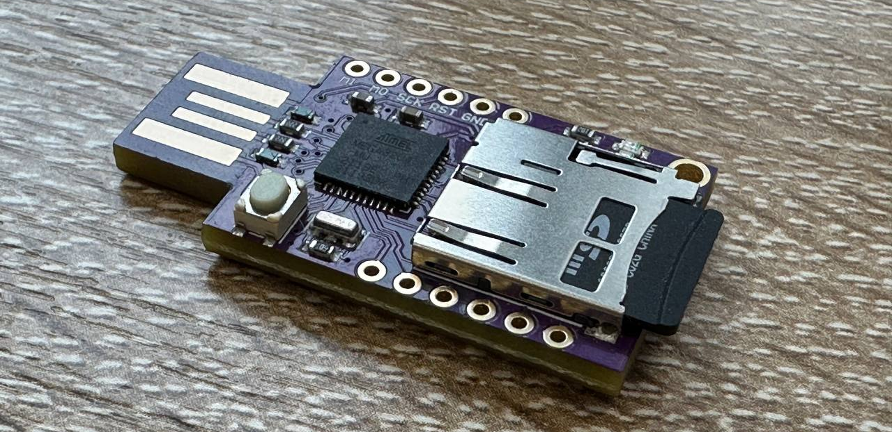
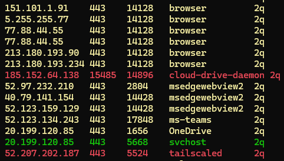
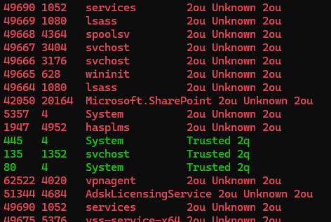
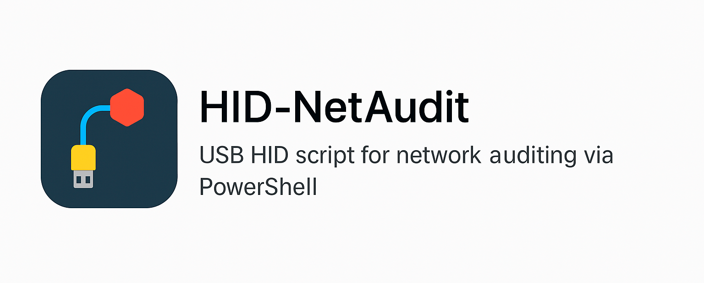

# HID-NetAudit

🛡️ HID-NetAudit is a standalone PowerShell HID script that runs from a USB device (based on ATmega32u4 with SD card), designed for local network connection, port, and process audit on Windows systems **without requiring administrator rights**.

---

## 📦 Project Structure

| File              | Description                                   |
|-------------------|-----------------------------------------------|
| `HID-NetAudit.ino`| Arduino sketch for ATmega32u4 with HID + SD  |
| `script.txt`      | PowerShell command script for analysis        |
| `README.md`       | Documentation                                 |
| `README.ru.md`       | Documentation on Russian                              |

---

## 🧰 Hardware Used

The setup uses a simple and accessible configuration based on Arduino:

| Component            | Description                                                                 |
|----------------------|-----------------------------------------------------------------------------|
| 🔌 **ATmega32u4 HID**| Board with ATmega32u4 chip supporting USB HID + microSD slot                |
| 💾 **SD card**       | Any microSD card (FAT32 format)                                              |

📦 Example board on Aliexpress:  
[➡️ ATmega32u4 with SD slot (AliExpress)](https://www.aliexpress.com/item/1005007171805928.html?spm=a2g0o.order_list.order_list_main.100.53a61802Hqjcdt)

💡 Connects directly via USB and works driver-free.  
The SD card stores the `script.txt` file which is executed as keyboard input by the HID device.



---

## 🧠 Process Architecture

🖥 USB HID (ATmega32u4)  
⬇️  
⌨️ Keyboard input emulation  
⬇️  
💻 PowerShell launch  
⬇️  
📄 Execute `script.txt`  
⬇️  
📡 Get IP addresses  
📊 Show connection table  
🛡 Check RDP / listening ports

---

## 🎮 Arduino Sketch `HID-NetAudit.ino`

Sketch functionality:

- Uses `Keyboard.h` and `SD.h`
- Automatically launches PowerShell (`Win+R → powershell`)
- Reads and executes `script.txt` from SD card
- Types PowerShell commands symbol by symbol
- Does not require admin privileges on the target

📎 Compatible with:
- Arduino Leonardo
- Teensy 2.0++
- Any HID + SD compatible device

---

## ⚡ PowerShell Script `script.txt`

Key features:

- 🌐 Retrieve local IPs
- 🔗 Analyze active TCP connections (`Established`)
  - Show PID and process name
  - Highlight external IPs
  - Color-code trusted / known / unknown processes
- 🔎 Scan `LISTEN` ports
  - Match against trusted whitelist
  - Highlight suspicious services
- 🔐 Detect RDP status (optional)
- 🧩 Requires no extra PowerShell modules

📋 Example Output:

```plaintext
Local IPs: 192.168.1.10

ESTABLISHED CONNECTIONS
8.8.8.8         443    3120   chrome          
212.45.66.1     445    4444   unknown.exe     

LISTENING PORTS CHECK
445   4      System           Trusted 
5555  1111   backdoor         ⚠ Unknown ⚠
```

### Example output: ESTABLISHED CONNECTIONS



### Example output: LISTENING PORTS CHECK



---

## 🛡 Purpose

- 💻 Quick local system audit
- 🔐 Silent network inspection (no logs)
- 🔍 SOC/BlueTeam investigation & monitoring
- 📚 Education & live demonstrations

---

## 🚨 Legal Disclaimer

> This project is intended **strictly for audit, educational, and defensive purposes**.  
> Unauthorized use may violate local laws or organizational policies.

---

## 🖼 Project Icon



🇷🇺 [Read in Russian](./README.ru.md)

